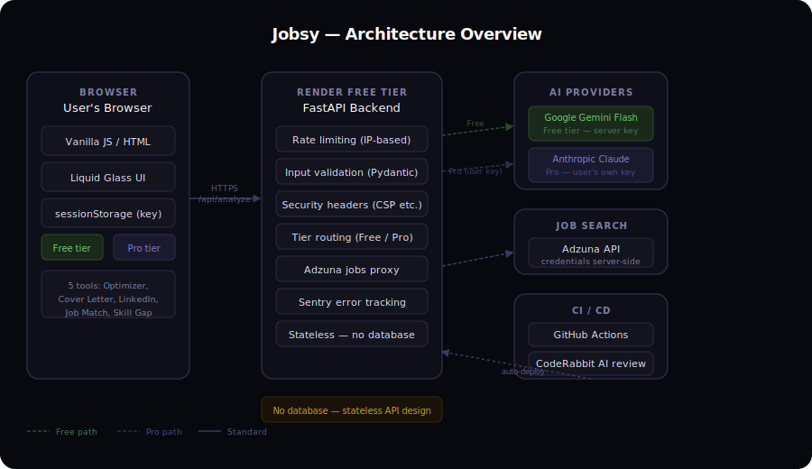

# Jobsy — AI Resume Optimizer

> **Live demo:** [jobsy-g0xw.onrender.com](https://jobsy-g0xw.onrender.com)

Turn a rough resume into an ATS-ready one — free, no sign-up, no account. A senior recruiter reads it, rewrites every bullet using the Google XYZ formula, simulates an ATS filter, runs a 7-second hiring-manager skim test, and optionally runs a mock interview, all in a single session.

---

## What it does

Five tools in one place:

| Tool | What happens |
|---|---|
| **Resume Optimizer** | 4-stage AI pipeline — recruiter scan, XYZ bullet rewrite, ATS simulation, 7-sec skim test. Optional mock interview with per-answer scoring. |
| **Cover Letter** | Generates a human-sounding letter tailored to the exact role and company. Tone selector. No templates, no buzzwords. |
| **LinkedIn Rewriter** | Rewrites headline, About section, and skills for the role you actually want. |
| **Job Match** | Extracts what you're good at from your resume and searches live listings that actually match. |
| **Skill Gap Analysis** | Identifies exactly what's missing and surfaces specific, free resources to close each gap. |

---

## Two tiers, one toggle

**Free** — works out of the box. No account, no setup, no catch. Powered by Google Gemini Flash (server-side key). Rate-limited to prevent abuse.

**Pro** — brings noticeably sharper output. Uses your own Anthropic API key, which stays in your browser only (sessionStorage, auto-cleared after 30 minutes of inactivity). Jobsy's server never sees it.

---

## Architecture

**Key design decisions:**

- **No database.** Fully stateless API — resumes and job descriptions are processed in-flight and never stored. Simplifies security significantly.
- **No frontend build step.** The entire UI is a single HTML/CSS/JS file — no React, no Webpack, no npm. Keeps deployment dead simple and eliminates a whole category of supply-chain risk.
- **Dual-tier AI routing.** Free requests go to Gemini (server-side key, daily cap, per-IP rate limiting). Pro requests are forwarded using the user's own Anthropic key — our server acts as a pass-through, Anthropic bills the user directly, we never touch their credits.
- **Adzuna job search is server-proxied.** Credentials never reach the browser.

---

## Tech stack

| Layer | Technology |
|---|---|
| Backend | Python 3, FastAPI, uvicorn |
| Frontend | Vanilla HTML/CSS/JS — zero npm, zero build step |
| Free tier AI | Google Gemini 2.0 Flash |
| Pro tier AI | Anthropic Claude Sonnet |
| Job search | Adzuna API (proxied) |
| Hosting | Render free tier |
| Error tracking | Sentry |
| CI | GitHub Actions + CodeRabbit AI reviewer |

---

## Security approach

This was built with a 13-layer security checklist applied throughout. Highlights:

- All AI-rendered output is escaped before `innerHTML` insertion — 34 call sites audited, verified with a real CSS/JS parser, not just visual inspection
- Input validation via Pydantic with explicit model allowlists, body size caps, and control-char sanitisation
- Security headers: CSP, HSTS, X-Frame-Options, X-Content-Type-Options, Referrer-Policy
- Consent checkbox gates all 5 data-submitting tools before any API call fires
- Pro-tier key stored in sessionStorage only, auto-cleared after 30 minutes idle, never reaches the server
- `pip-audit` runs in CI on every PR

Full audit record available on request.

---

## UI design

Liquid glass dark theme. Gradient-border cards with soft ambient glow (no `backdrop-filter` dependency — replaced with a `background-clip: padding-box / border-box` technique that actually renders consistently). Instrument Serif + Inter typography. Built without any CSS framework.

---

## Development challenges

**AI output as a security surface.** When you render AI-generated text into `innerHTML`, every field is a potential XSS vector. The solution — wrapping every interpolation in an `esc()` function before insertion — sounds simple but has to be applied consistently at 34+ sites across 1,600 lines of JavaScript. One miss in the Skill Gap renderer was the one finding from a full security audit of the codebase.

**Dual-tier auth with no server-side user state.** Routing between a server-side key (free) and a per-user key (pro) in a stateless app, without cookies or sessions, required careful header-based routing (`X-Tier`, `X-Api-Key`) and server-side validation of both paths independently.

**CSS architecture at scale without a build step.** Maintaining a consistent design system across 1,600 lines of CSS in a single file — without Tailwind, without CSS Modules, without a linter — requires enforcing conventions manually. Several bugs in this codebase were caused by truncated multi-value CSS declarations (e.g. `box-shadow: 0 2px 0 rgba(0,0,0,.15),` cut off before the closing paren) that browsers silently discard. Found via a programmatic CSS parse rather than visual debugging.

**Free-tier cold starts.** Render free tier spins down after 15 minutes of inactivity. First request after spin-down takes ~30 seconds. Handled with a dedicated UI overlay ("Waking up the server…") triggered if a request takes more than 3 seconds, so the blank wait doesn't look broken.

---

## Deployment

Hosted on Render free tier. Auto-deploys from the main branch. No manual deployment steps.

Health check endpoint at `/health` — monitored by UptimeRobot.

---

## Legal

- [Privacy Policy](privacy.html) — no cookies, no tracking, data processed in-flight only
- [Terms of Service](terms.html)

---

## About

Built by [Sidharth S](https://linkedin.com/in/sidharth-s-916s) 

[GitHub](https://github.com/Sidharths916) · [LinkedIn](https://linkedin.com/in/sidharth-s-916s)
